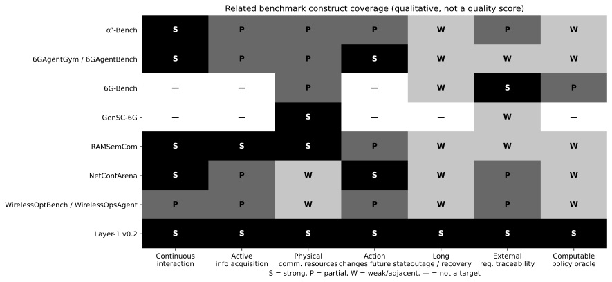
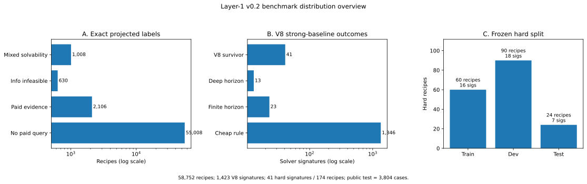

# Layer 1 — Source-grounded Emergency Communication Benchmark

本层拥有“现实山区灾前需求如何变成可评测通信决策任务”。它不从现有 tool/capability 反推题目。

## Construction contract

1. `Original requirement`：山区供电不足、通信间歇中断导致节点失联/数据无法回传，目标是灾前低功耗持续稳定监测。
2. `Source grounding`：field deployment、standard、government/industry material 分别证明 operational need、能力和约束；证据等级与未知项保留。
3. `Operational corpus`：先逐条抽取 obligation、authority、observation、action、constraint、transition、outcome，不从 simulator 反推题目。
4. `Taxonomy`：由 corpus 聚类产生 Operational Family，并与 Agentic Capability / Hardness / Operating Regime 正交。
5. `Historical semantic dedupe`：candidate 产生后才查旧 repo；语义等价直接继承旧 verdict，不重复跑实验。
6. `Task specification`：给 goal、hard constraints、resource budgets、authority/effect envelope、time window 与 provenance。
7. `Simulator mapping`：外部 source 支持而 simulator 缺失的 state/action 记为 SIMULATOR_GAP，不因当前跑不了而删题。
8. `Case generator + oracle`：从 source-backed profiles 生成大量 case，并构建 external oracle。
9. `Validity + hardness`：完成 shortcut、ordinary baseline、held-out 与 non-toy coverage 审计后才进入 policy evaluation。

## Validity / hardness gate

一个 Decision Benchmark task 至少要能回答以下问题：来源是否支持这个 operational need；是否存在真实选择而非唯一已知写入；观测/不确定性是否可能改变选择；资源或时序约束是否实际 binding；不同合法策略是否产生 materially different physical outcomes；强 ordinary mechanism 是否仍留下需要决策的空间。增加节点数、seed 或窗口数量本身不增加 decision richness。

## Benchmark-construction precedents

本层采用的不是“现场日志逐条切 train/test”单一范式，而是 **source-grounded synthetic / simulation benchmark**：现实来源定义合法问题空间，generator 在预先声明的范围内系统实例化，simulator 因果执行，独立 evaluator/oracle 判定结果。该范式在通信、自动驾驶和 embodied AI 中有成熟先例；详细 ownership 与生成纪律见 [`ENVIRONMENT-GENERATION-CONTRACT.v0.1.md`](ENVIRONMENT-GENERATION-CONTRACT.v0.1.md)。

| Benchmark / platform | 现实 grounding | case / episode 来源 | 与本项目的对应关系 |
|---|---|---|---|
| **DeepMIMO** | 具体 3D 环境 + Wireless InSite ray tracing | 参数化生成 channel dataset | 物理/场景模型先于 synthetic samples；scenario + 参数集合可完整复现。https://arxiv.org/abs/1902.06435 |
| **CARLA Leaderboard** | NHTSA pre-crash typology | 交通 scenario template 在道路/天气/位置中参数化实例化 | 现实 taxonomy 定义“什么问题值得测”，具体危险 episode 由 simulator 系统生成。https://leaderboard.carla.org/scenarios/ |
| **ScenarioNet** | Waymo、nuScenes、Lyft L5、nuPlan 真实轨迹 | canonical scenario → MetaDrive closed-loop simulation | `real trace → canonical scenario → simulator` 是未来通信 trace-grounded 版本的直接参照。https://proceedings.neurips.cc/paper_files/paper/2023/hash/0c26a501df8fb919a0350e2df06b5d39-Abstract-Datasets_and_Benchmarks.html |
| **Waymax / Waymo CAT** | Waymo Open Motion Dataset；road/test-track/crash data + ODD expert knowledge | logged scenario replay、counterfactual perturbation、fully synthetic hazardous scenario | controlled stress 可以合法存在，但必须由 coverage / ODD 驱动，不得由某个算法输赢驱动。https://waymo-research.github.io/waymax/docs/ · https://waymo.com/blog/2022/12/waymos-collision-avoidance-testing/ |
| **Habitat Challenge** | Gibson / Matterport3D 等真实扫描环境 | unseen scene 中自动采样起点、方向和目标，simulator 闭环执行 | `real environment + synthetic episode + hidden test scene` 是成熟范式。https://aihabitat.org/challenge/2021/ |
| **ALFWorld** | ALFRED household task semantics | task 映射到 TextWorld simulator 生成交互 episode | task semantics 可以真实、episode 可以合成；claim 必须限制在 simulator contract。https://arxiv.org/abs/2010.03768 |
| **6G-Bench** | 3GPP/IETF/ETSI/ITU-T/O-RAN 标准化活动 | 30 类任务；113,475 scenarios → 自动筛选 / expert validation → 3,722 题 | 与本项目最近的通信 provenance 先例：标准定义问题空间，具体题目由 benchmark designer 大规模生成。https://arxiv.org/abs/2602.08675 |
| **DORA** | 45 个真实灾害事件 + 真实异构地理数据 | 515 expert-authored operational tasks + verified trajectories | 灾害 benchmark 中“真实事件/data grounding + 人工/程序化任务构造”同样成立。https://arxiv.org/abs/2605.11633 |

这里的合法性边界固定为：**synthetic 不是问题，method-conditioned generation 才是问题。** 正式 generator 的轴、范围与环境 transition 必须在 proposed method 评测前冻结；baseline 只负责测量 hardness / shortcut，不负责反向塑造 benchmark。

## 2026-10-06 status correction

此前 README 将当前 v0.2 描述成“research-frozen / Q11-only blocker”，并把最早目标写成 `PASS / strong`。该判断已经撤回。

最新 [`HARD-SURVIVOR-FAILURE-ATLAS.v0.1.md`](HARD-SURVIVOR-FAILURE-ATLAS.v0.1.md) 显示：174 hard recipes 只对应 41 个 exact hard signatures，而且 41 / 41 全部坍缩到同一个 `FINITE_CROSSING_WINDOWS + GATEWAY_SUMMARY_QUERY + H2×H3×H4` mechanism family。当前结果足够做 mechanism discovery，不足以把 continuous interaction、active acquisition、physical resource coupling、recovery coverage 全部写成 benchmark-wide `Strong`。

因此当前状态固定为：

```text
MECHANISM_DISCOVERY_READY
+ HARD_MECHANISM_COVERAGE_REOPENED
+ V0.6 PRE-ORACLE GENERATION COMPLETE / ORACLE ADMISSION NEXT
+ PRISTINE STRUCTURAL GENERALIZATION OPEN
+ Q11 HUMAN SOURCE REVIEW PENDING
= NOT_BENCHMARK_ADMIT
```

Layer 3 在这些 blocker 关闭前暂停。后续任何 `Strong` 都必须满足 [`ENVIRONMENT-GENERATION-CONTRACT.v0.1.md §6`](ENVIRONMENT-GENERATION-CONTRACT.v0.1.md) 的显式证据门，而不是由 README 文案授予。

## Paper-facing benchmark landscape and statistics

<!-- BEGIN GENERATED:LAYER1_PAPER_ASSETS -->

本节由 `scripts/make_layer1_paper_figures.py` **自动生成**。数值 authority 是 committed `results/benchmark` frozen artifacts；related-work judgment authority 是 `related-benchmark-sources.json`。README、CSV 与图均为这两类 authority 的投影。

### Related benchmark landscape



图中 `S / P / W / —` 分别表示 Strong / Partial / Weak-adjacent / Not a target。该图负责 related-work construct 定位；质量评估与 leaderboard 由各 benchmark 自身指标承担。

| Benchmark / system | 核心评测任务 | 与本项目直接相关的已占位置 | Paper / artifact | Repo 内审计入口 |
|---|---|---|---|---|
| **α³-Bench** | 动态 6G 条件下的多轮 UAV reasoning/control，含 tool call 与 A2A | interactive wireless-Agent control、network-aware multi-turn evaluation | [paper](https://arxiv.org/abs/2601.03281) · [artifact](https://github.com/maferrag/AlphaBench) | [audit](../../docs/s3-novelty/prior-art-mother-papers.md) |
| **6GAgentGym / 6GAgentBench** | 42 个 typed tools 的闭环 6G network-management agent，learned Experiment Model 支撑在线训练/评测 | closed-loop tool execution、state-mutating actions、agentic learning | [paper](https://arxiv.org/abs/2603.29656) | [audit](../../docs/s3-novelty/prior-art-mother-papers.md) |
| **6G-Bench** | 从标准化活动抽取网络 decision tasks，并做大规模生成、筛选与 regret/oracle reasoning | source/standard-grounded taxonomy、large-scale generator/filter、oracle decision | [paper](https://arxiv.org/abs/2602.08675) · [artifact](https://github.com/maferrag/6G-Bench) | [audit](BENCHMARK-CONSTRUCTION-PROTOCOL.v0.1.md) |
| **GenSC-6G** | AWGN/RF interference 下的 semantic classification / localization / recovery testbed | physical semantic-channel evaluation、noise/SNR axis | [paper](https://arxiv.org/abs/2501.09918) · [artifact](https://github.com/CQILAB-Official/GenSC-6G) | — |
| **RAMSemCom** | 当前多模态信息不足时主动请求额外内容，并在无线带宽/deadline 下继续决策 | active information acquisition、iterative sufficiency loop、wireless acquisition cost | [paper](https://arxiv.org/abs/2505.23275) | [audit](../literature/RELATED-WORK.md) |
| **NetConfArena** | GNS3 多设备网络中的闭环配置；hidden executable tests 验证最终网络行为 | executable closed-loop network benchmark、action→environment feedback | [paper](https://arxiv.org/abs/2608.23179) · [artifact](https://github.com/liujona/NetConfArena) | [audit](../../docs/s5-benchmark/s6-9-benchmark-comparison.md) |
| **WirelessOptBench / WirelessOpsAgent** | stale/conflicting telemetry 下的 execution-state decision / action assurance | evidence-grounded action validity、execution-time support checking | [paper](https://arxiv.org/abs/2608.08277) | [audit](../evaluation/WIRELESSOPSAGENT-STYLE-BASELINE-v1.md) |

当前抢点保持为组合 construct：

```text
source-grounded operational obligation
+ continuous / non-anticipative interaction
+ action-relative evidence sufficiency
+ costly heterogeneous evidence acquisition
+ physical communication/resource transition
+ obligation-feasibility transition
+ long intermittent outage / recovery semantics
+ external causal exact oracle
```

论文中的 **Evidence Sufficiency** 直接绑定 action validity 与 future obligation feasibility；inference quality 属于独立评测层。动作后果由未来义务可满足集合的变化刻画，reward 保留为辅助观测。

### Current v0.2 distribution



下表全部由 frozen artifacts 重算。recipe、solver signature、hard survivor 与 public-test case 各自拥有独立统计口径：

| Distribution level | Current v0.2 | Interpretation |
|---|---:|---|
| Generator universe | **58,752 recipes** | exact recipe-label universe；release case count 由 split/freeze authority 定义 |
| `NO_PAID_QUERY_REQUIRED` | **55,008 (93.63%)** | exact 投影下无需额外付费 query |
| `PAID_EVIDENCE_REQUIRED` | **2,106 (3.58%)** | paid acquisition 对可实现策略有正价值 |
| `INFORMATION_INFEASIBLE` | **630 (1.07%)** | 各世界可物理解，但不存在合法 observation-matched common policy |
| `MIXED_WORLD_SOLVABILITY` | **1,008 (1.72%)** | alias bundle 内物理 solvability 不一致 |
| V8 input | **1,423 solver signatures** | 进入 strong-baseline ladder 的结构单元 |
| V8 survivors | **41 signatures / 174 recipes** | **2.88%** 的 V8 signatures 留下 hard headroom；该集合拥有 hard-core 语义 |
| Hard train/dev/test | **16/18/7 signatures; 60/90/24 recipes** | structure-aware hard split |
| Frozen public test | **3,804 cases** | entire public test split；SHA256 `23307c06ed7c9f9d992db4bcc5cee12b1703e38d997a293b3d1677cc1b91b6f5` |

Hard-survivor recovery coverage：`train`=['NO_RECOVERY_STATE', 'OUTAGE_CACHE_RETAIN', 'RECONNECT_RECONCILE_OBJECTIVE_CHECK']；`dev`=['NO_RECOVERY_STATE', 'OUTAGE_CACHE_RETAIN', 'RECONNECT_RECONCILE_OBJECTIVE_CHECK']；`test`=['NO_RECOVERY_STATE', 'OUTAGE_CACHE_RETAIN', 'RECONNECT_RECONCILE_OBJECTIVE_CHECK']。该项负责验证 train/dev/test 均覆盖声明的 recovery 轴；现场 outage 分布由外部 deployment evidence 单独负责。

### Construct evidence and reopened strong targets

这张表不再把最早 `调研cache.md §4.7` 的“强×7”目标直接判成已完成。2026-10-06 hard-survivor audit 发现 41 个 hard signatures 全部坍缩到同一 `FINITE_CROSSING_WINDOWS + GATEWAY_SUMMARY_QUERY + H2×H3×H4` mechanism family，因此除 exact-oracle 基础外，paper-facing `Strong` claim 重新打开。完整验收条件见 `ENVIRONMENT-GENERATION-CONTRACT.v0.1.md §6`。

| 原始 construct 维度 | 当前证据状态 | 自动化证据摘要 / blocker |
|---|---|---|
| 连续交互 | **SUPPORTED-SCOPED / STRONG OPEN** | 现有 41 survivors 具有 causal multi-step interaction，但只覆盖一个 hard mechanism family；需要跨独立 process family + fixed/open-loop non-saturation |
| 主动补信息 | **PARTIAL / STRONG OPEN** | 当前 hard evidence regimes=["GATEWAY_SUMMARY_QUERY"]；PASSIVE_ACK_ONLY / MIXED_PASSIVE_QUERY_PROBE 没有独立 hard survivors，conditional-acquisition gate 未闭合 |
| 物理通信资源 | **SUPPORTED-SCOPED / STRONG OPEN** | 当前 hard service processes=["FINITE_CROSSING_WINDOWS"]；共享机会/资源已有 intervention 证据，但 mechanism coverage 过窄 |
| 动作改变后续状态 | **SUPPORTED-SCOPED / STRONG OPEN** | first-irreversible-loss audit 已在 query/send/wait/satellite commitment 上定位 option destruction；仍需新 generator family 与 mutation/holdout 复验 |
| 长期失效 / 恢复 | **PARTIAL / STRONG OPEN** | split 中 recovery labels={"train": ["NO_RECOVERY_STATE", "OUTAGE_CACHE_RETAIN", "RECONNECT_RECONCILE_OBJECTIVE_CHECK"], "dev": ["NO_RECOVERY_STATE", "OUTAGE_CACHE_RETAIN", "RECONNECT_RECONCILE_OBJECTIVE_CHECK"], "test": ["NO_RECOVERY_STATE", "OUTAGE_CACHE_RETAIN", "RECONNECT_RECONCILE_OBJECTIVE_CHECK"]}，但参数覆盖不等价于独立 recovery hard mechanism |
| 外部需求可追溯 | **SUPPORTED-SCOPED / STRONG OPEN** | source/profile/provenance machine closure 已有；真实 Q11 human/source review 尚未完成 |
| 可计算最优策略 | **SUPPORTED / strongest current component** | hindsight / full-current / observation-matched / no-paid-query exact references 已实现；最终 Strong 仍要求独立 brute-force/mutation/retry-legality release audit 全部绑定 |

### Regeneration discipline

- 数值与比例：只从 committed `results/benchmark` 的 exact summary、V8 summary、structure-aware split 与 public-test freeze 自动读取。
- related-work 链接与定性覆盖：只维护 `related-benchmark-sources.json` 一个 source ledger；README 表与 landscape 图由脚本生成。
- `python3 scripts/make_layer1_paper_figures.py --check` 用于 CI/提交前漂移检查；任何 README/JSON/CSV/图资产不一致均返回非零。
- SVG 为论文候选资产，PNG 为 README/slide 预览。
- 数值更新路径固定为 frozen results → generator → README/JSON/CSV/SVG/PNG；提交前由 `--check` 验证闭环。

<!-- END GENERATED:LAYER1_PAPER_ASSETS -->

## Benchmark graduation contract

Layer 1 graduation 由下面六组条件共同定义。Generator case 产出与 hard-case 数量属于中间构造证据；正式规范由 [`spec/benchmark/LAYER1-DECISION-BENCHMARK-v0.2.md`](../../spec/benchmark/LAYER1-DECISION-BENCHMARK-v0.2.md) 持有，release gate 由 [`BENCHMARK-QUALITY-GATE.v0.1.md`](BENCHMARK-QUALITY-GATE.v0.1.md) 执行。该摘要继承 `cache06.md` 与 `调研cache.md` 已冻结的设计决策。

### G1. Agentic case threshold

进入主 Decision Benchmark 的 case 必须同时具有：

1. **Sequential interdependence**：后续动作依赖前序动作产生的新 observation / execution result；
2. **Partial observability**：关键当前状态不能直接暴露给 policy，必须通过合法 observation / query / execution feedback 获得；
3. **Adaptive strategy formation**：新证据能够改变后续合法/可行策略；固定 open-loop 序列可完成的 case 归入 communication reasoning / conformance。

每个主 hardness family 都要做 single-shot / open-loop reducibility audit。若把当前合法 observation 一次性给 policy 后，一轮静态选择或固定 open-loop sequence 已接近 observation-matched oracle，则该 case 降为 communication reasoning / conformance，不用于证明 Agentic Communication 能力。

### G2. Source-grounded causal communication loop

Benchmark 的可 defend 空间要求以下对象同时存在：

- 现实义务可追溯到 field / standard / operational source；
- evidence sufficiency 直接约束发送、等待、探测、回退等具体行动；
- 主动取证支付真实时间、链路机会或其他资源成本，并允许 timeout / failure；
- 正常发送、ACK、被动遥测等自然反馈不能被普通基线剥夺；
- action 消耗真实通信/资源状态，并改变后续 obligation feasibility；
- 长期间歇连接、状态老化与恢复属于同一 causal process；
- evaluator / oracle 与 Agent 输入隔离。

### G3. EvidenceNeed and oracle semantics

EvidenceNeed 不能由“存在未知字段”定义。对于同一合法历史下的 alias worlds，必须先排除共同 zero-regret commitment；随后比较 observation-matched `query-enabled` 与 `no-paid-query` 最优策略，只有付费取证在保留 passive telemetry、ACK、normal-send-as-probe 后仍严格增加可实现任务价值，才能声明正 EvidenceNeed。

Oracle 至少分离：

- hindsight physical feasibility；
- full-current-state causal feasibility；
- observation-matched exact policy；
- observation-matched no-paid-query policy。

相同 visible history 必须选择相同 action；逐 hidden world 各取一条成功轨迹不构成合法 policy。

### G4. Strong ordinary-baseline headroom

Hardness 不能靠弱 baseline 制造。正式 ladder 至少覆盖：deadline-reserve/EDF、greedy fallback、fixed-priority / least-slack、latest-feasible-send、always-query-then-plan、never-query + passive feedback、myopic VoI、belief-aware rolling planner、开发集调优的 shallow rule/tree，以及 observation-matched exact reference。

Admission 看的是普通短视/浅层策略在**结构留出集**上是否饱和；generic exact 能解小实例是预期行为，不构成 benchmark invalidity。

### G5. Communication attribution and causal interventions

Benchmark 必须证明“难点来自 communication/information structure”，不能把模型基础能力不足误写成通信困难。正式 evaluation matrix 至少应包含适用的：

- full system；
- no communication / no paid acquisition；
- oracle communication / perfect current observation；
- no active sensing；
- no memory（若任务需要历史）；
- remove resource conflict；
- relaxed deadline；
- controlled delay / stale evidence / disabled fallback 等单因素 intervention。

若移除资源竞争、给予及时完美证据或放宽 deadline 后困难没有按预期减弱，需要重新审查 construct validity。

### G6. Release-quality benchmark artifact

正式 `BENCHMARK_ADMIT` 还要求：source/profile/case provenance、V0–V9、structure-aware held-out split、near-duplicate leakage audit、Q0–Q12、human/source audit、evaluator mutation tests、baseline/result manifests、统计报告、known-flaw / maintenance policy 与 frozen benchmark version 全部闭合。

### Current v0.2 status against the graduation contract

| Graduation requirement | v0.2 current state | Disposition |
|---|---|---|
| Source-grounded operational obligation / Family Identity | T1 source correction、profile/provenance、Family merge discipline 已闭合；Q11 真人审计尚未签字 | **SUPPORTED-SCOPED / HUMAN REVIEW OPEN** |
| Partial observability + causal evidence | alias worlds、owner query、passive ACK、normal send-as-probe、non-anticipative history 已实现；hard surface 只剩单一 evidence regime | **SUPPORTED-SCOPED / COVERAGE OPEN** |
| Real acquisition/execution cost changes future feasibility | 当前 v0.2 query/send/wait/retry/ACK 在统一 transition 中；first-loss audit 可定位 option destruction | **SUPPORTED-SCOPED / COVERAGE OPEN** |
| External exact oracle | hindsight / full-current / observation-matched / no-paid-query 参照与 `INFORMATION_INFEASIBLE` 已实现 | **SUPPORTED / RELEASE AUDIT CONTINUES** |
| Strong baseline / shortcut audit | V8 ladder 已完成，保留 41 signatures / 174 recipes；但全部属于同一 H2×H3×H4 mechanism family | **FAIL AS COVERAGE CLAIM / DISCOVERY EVIDENCE ONLY** |
| Structure-aware held-out split | 历史 split 的 solver-signature/近邻 leakage 审计通过，但 7-signature test 已在 `fdc0846` 暴露 | **REGRESSION ONLY / PRISTINE HOLDOUT OPEN** |
| Single-shot / open-loop reducibility as a named release audit | 41/41 hard signatures：observation-matched exact 成功；no-paid-query 与 blind open-loop 均不能保证任务；full-current-state 可解 | **PASS / release evidence** |
| Communication-attribution intervention matrix | 41/41 hard signatures 通过；41/41 source deadline + controlled capacity binding，17/41 另有 satellite-budget binding | **PASS / release evidence** |
| Frozen-split LLM/reasoning baseline | DeepSeek Flash：7/7 hard signatures 失败，181 API calls，0 invalid action，全部 `DEADLINE_EXPIRED` | **PASS / baseline complete** |
| Q10 reproducibility / release manifest | v0.2 pre-release manifest 绑定 31+ artifacts；one-command digest validation PASS | **PASS** |
| Q11 human/source audit | v0.2 stratified sample 已重建；machine preaudit 23/23 PASS；真实 reviewer 尚未签五项 | **BLOCKED** |
| Environment/generator method-independence contract | 已建立 v0.1 authority；下一版正式 generator 尚未按该 contract 重建 | **BLOCKED / REBUILD** |
| Hard-mechanism coverage | 当前只覆盖单一 survivor family；H1/H5/MULTI_WINDOW 等未形成独立 hard mechanism | **BLOCKED / REOPENED** |
| Pristine structural generalization | 历史 test 已暴露；新 cohort 尚未 preregister/freeze | **BLOCKED / REOPENED** |
| Q0–Q12 + formal `BENCHMARK_ADMIT` | 历史 machine checklist 仍为 12 PASS / 1 BLOCKED，但不编码本次 coverage/test-provenance blocker | **NOT SUFFICIENT FOR RELEASE** |

因此当前判断固定为：**Layer 1 已拥有可复现的 source/oracle/validity/failure-discovery 基础，但最终 benchmark 尚未做好。下一阶段只允许按 frozen environment/generation contract 补 coverage、机制门和 pristine holdout；不允许 Layer 2/3 结果反向塑造 case distribution。**

## Current authority and disposition

**当前 Layer 1 全局状态只由 [LAYER1-AUTHORITY.md](LAYER1-AUTHORITY.md) 拥有。** 本 README 不再以某个 generator/receipt 版本代表全局进度。

当前一级 taxonomy：

- **T1 Monitoring Information Continuity** — MAIN；
- **T2 Warning Delivery & Response Handoff** — boundary extension，当前 actor-chain environment 为 `SIMULATOR_GAP`。

O1–O6 是历史 T1 operational regime/conformance assets；完整 task surface 与 closure 见 [TASK-COVERAGE-CLOSURE.v0.1.md](TASK-COVERAGE-CLOSURE.v0.1.md) 和 [TASK-SURFACE-REGISTRY.v0.1.json](TASK-SURFACE-REGISTRY.v0.1.json)。

Q11 source review 于 2026-10-05 发现 DB44/T 2457-2024 profile 的 pre-release extraction bug：旧 cadence 对应表 15 地裂缝，而项目原始场景与 intended T1 authority 是山区滑坡。profile 已改为 `hazard_type=landslide`，采用 §9.2.2.2 表 11；随后 retry legality 也修正为“未知是否已交付 ≠ 禁止重试”。`v0.2-retry-legality` 已完成 exact→V0–V9→split→public-test 全链重算。当前 exact 为 8,064 solver signatures；V8 最终保留 41 hard signatures / 174 recipes；split hard train/dev/test signatures = 16/18/7；public test = 3,804 cases。v0.2 LLM baseline、agentic-reducibility、communication-attribution、release manifest 与 Q0–Q12 已重新冻结；Q11 sample 也已基于 v0.2 重建并完成 23/23 machine preaudit，仍需真实 reviewer。机器状态见 [LAYER1-CURRENT-STATE.v0.1.json](LAYER1-CURRENT-STATE.v0.1.json)。

v0.1–v0.5、receipt-race、receipt-chain、joint query–satellite Pareto 和 continuation frontier 继续保留，但它们的角色是 generator/mechanism regression、exact-reference 与 shortcut audit。尤其 188-cell receipt grid **不是 benchmark case count**；当前普通 reserve/fixed-read/wait-ACK family 仍覆盖 frozen receipt-chain 的 exact cost frontier。

### Construction lineages and current gate

| Lineage | Current disposition |
|---|---|
| v0.2 | scoped mechanism-discovery/regression asset: 41 exact signatures / 174 recipes in one H2×H3×H4 family; historical test is exposed |
| v0.6 | generation reproducibility PASS; benchmark validity FAIL because every admitted case has a blind public satellite-only completion policy |
| v0.7 | process-support correction retained; gateway owner-local receipt visibility retained; gateway action/data-location ownership reopened after static correctness audit; 36-cell pilot is diagnostic only; no hard case is admitted |

v0.7 local pre-oracle r1 contains 103,408 base scenarios, 74,952 `ALL_WORLD_PHYSICAL` bases and 2,023,704 variants / 863,460 pre-oracle structure IDs. These counts are construction coverage only. They cannot be used as task count, hard-case count or paper performance denominator.

The next gate follows `cache06.md`, not another version bump:

```text
frozen v0.7 universe
→ freeze gateway/center visibility boundary                          [DONE for gateway receipt; center remains SIMULATOR_GAP]
→ bounded gateway-local staged-exact pilot                           [DONE: DIAGNOSTIC ONLY]
→ explain easy / causal-infeasible bifurcation                       [DONE: SCOPED DIAGNOSTIC]
→ audit data-location / action ownership                             [DONE: BLOCKER FOUND]
→ freeze gateway-local legal action lifecycle                        [CURRENT]
→ gateway-local non-separable cross-stage witness                    [BLOCKED]
→ dynamic sufficiency after later observations
→ dedicated query / passive feedback / send-as-probe competition（only where transport is legal）
→ causal intervention attribution
→ staged exact admission per placement
     blind
     → full-current
     → no-paid-query with natural feedback
     → observation-matched legal acquisition
→ ordinary strong-baseline ladder
→ pristine structural split
→ Q11 human/source review
→ BENCHMARK_ADMIT
```

The historical placement audit invalidated the discarded center/gateway mixed-visibility adapter. Gateway remains the primary policy placement and gateway receipt remains owner-local, but `V07-GATEWAY-ACTION-OWNERSHIP-REVIEW.v0.1.md` now blocks gateway exact admission: the provisional adapter reused an end-to-end `SEND_TERR → gateway receipt → center ACK` action as gateway-local execution without an explicit report-location/control transition. The 36-cell pilot and bifurcation result therefore remain diagnostic only. Any `SEARCH_LIMIT` remains `UNRESOLVED_COMPUTATION`.

Current execution ledger:

    source/task/provenance correction                     [DONE]
    → v0.2 exact/validity/failure atlas                   [DONE; SCOPED REGRESSION]
    → v0.6 reproducible construction                      [DONE; NEGATIVE LINEAGE]
    → v0.6 global shortcut proof                         [DONE; VALIDITY FAIL]
    → v0.7 process-support correction                     [DONE]
    → v0.7 pre-oracle generation + schema audit          [DONE LOCAL R1]
    → v0.7 specific TIGHT satellite-shortcut preflight   [DONE; 0 candidate shortcut cells]
    → placement / visibility boundary                     [DONE OWNER-LOCAL RECEIPT / CENTER GAP]
    → gateway-local bounded 36-cell pilot                 [DONE; DIAGNOSTIC ONLY]
    → easy / causal-infeasible bifurcation attribution    [DONE; DIAGNOSTIC]
    → gateway action/data-location ownership audit        [DONE; BLOCKER FOUND]
    → freeze gateway-local legal action lifecycle         [CURRENT]
    → gateway-local dynamic mechanism witnesses           [BLOCKED]
    → staged exact admission per placement                [BLOCKED]
    → ordinary-baseline red-team                         [PENDING]
    → pristine structural holdout                        [PENDING]
    → Q11 human review                                    [PENDING]
    → BENCHMARK_ADMIT                                     [CLOSED]

默认不继续增加 generator 版本、stage 数或局部 fixture 来制造 headroom；不先训练 RL/LLM；不让 Layer 2/3 方法反向塑造 Layer 1 分布。


## Construction authority

Formal benchmark construction, admission, validity, hardness, non-toy coverage, baseline and release rules are owned by [BENCHMARK-CONSTRUCTION-PROTOCOL.v0.1.md](BENCHMARK-CONSTRUCTION-PROTOCOL.v0.1.md). The protocol includes the Family Identity Test: Family boundaries are determined by protected subject, completion predicate, authority chain and lifecycle scope; warning level, outage/reconnect, path choice, cache/retransmission and other capabilities/regimes do not automatically create new Families.

Large-scale case generation, oracle construction, automatic validity filtering, provenance classes and held-out split are owned by [CASE-GENERATION-PROTOCOL.v0.1.md](CASE-GENERATION-PROTOCOL.v0.1.md). Frozen case artifacts follow [CASE-SCHEMA.v0.1.json](CASE-SCHEMA.v0.1.json). Candidate-family records follow [CANDIDATE-SCHEMA.v0.1.json](CANDIDATE-SCHEMA.v0.1.json). Status now separates SOURCE_GAP / SOURCE_SUPPORTED / SIMULATOR_GAP / HISTORICALLY_CLOSED / ADMISSION_READY / BENCHMARK_ADMIT.

Construction order is fixed:

    external operational corpus
    → canonical operational objects
    → provisional taxonomy
    → candidate family + source validation
    → historical semantic dedupe
    → state/action/transition/oracle contract
    → simulator mapping / explicit gaps
    → case generator
    → task/outcome validity
    → hardness + non-toy coverage
